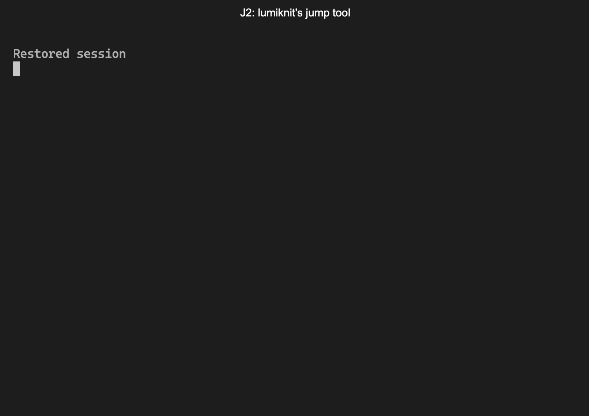

# J2

> A lazy brown programmer will jump over the directories quickly!

lumiknit's jump helper, the second edition.



## Features

- Fuzzy finder for path
	- With fzf-like TUI
	- Find directory and cd/pushd/edit with less typing
- Clone repository with less path-conflictions
- Make tagged sandboxes
  - Which managed by date and random number
  - With README note

## Installation

- Run `cargo install --git https://github.com/lumiknit/J2`
- Add configuration in shell profile, such as `.bashrc`, `.zshrc` or `$profile`

### Example Configuration for Sh / Bash / Zsh

```sh
# You may need to set HOME if not
export HOME=/Users/user

# Repository path, where cloned repositories are stored
export J2_REPOS_PATH="$HOME/repos"

# Root paths to fuzzy find and jump. Multiple paths are separated by colon.
export J2_FIND_BASE_PATHS="$HOME/repos:$HOME/workspace"

# ignore file path containing directories to ignore
# You can write this file as any other ignore file, such as .gitignore!
# export J2_IGNORE="$HOME/.J2_ignore"

# Path to jones (j-zone, sandbox).
export J2_JONES_PATH="$HOME/workspace/jones"

# Default editor to be used by J2
export J2_EDITOR="code"

# Initialize j2 functions
eval "$(j2 shell-init)"
```

Note that the above will override some commands such as `J`, `j`, `j-`, `j--`, `j.`.

### Example Configuration for PowerShell

Since PowerShell does not support `eval`,
you should insert the script from `j2 shell-init` manually.

- `Add-Content $PROFILE $(j2 shell-init pwsh)` to add the script to your profile
- Or create a file `Add-Content "<path_to_script>" $(j2 shell-init pwsh)` and import it in your profile such as `Add-Content $PROFILE ". <path_to_script>"`

Then, add the following configuration to your profile:

```pwsh
# You may need to set HOME if not
$env:HOME = "/Users/user"

# Repository path, where cloned repositories are stored
$env:J2_REPOS_PATH = "$env:HOME/repos"

# Root paths to fuzzy find and jump. Multiple paths are separated by semicolon.
$env:J2_FIND_BASE_PATHS = "$env:HOME/repos;$env:HOME/workspace"

# ignore file path containing directories to ignore
# You can write this file as any other ignore file, such as .gitignore!
# $env:J2_IGNORE = "$env:HOME/.J2_ignore"

# Path to jones (j-zone, sandbox).
$env:J2_JONES_PATH = "$env:HOME/workspace/jones"

# Default editor to be used by J2
$env:J2_EDITOR = "code"
```

## Usage

### Find Path

To find some subdirectory in your `J2_FIND_BASE_PATHS`, run `j2 find`. See `j2 find --help` for more details.

### Jump to Path

To jump to some subdirectory in your `J2_FIND_BASE_PATHS`, just run `j <QUERY>` (equivalent to `J cd <QUERY>`).
It'll open a TUI to find a directory with the given query, and cd to the selected directory.

Instead of `J cd`, you can use

- `j! <QUERY>` (equivalent to `J edit <QUERY>`): open editor
- `J pushd <QUERY>`: push directory (See [Pushd and Popd](https://en.wikipedia.org/wiki/Pushd_and_popd))

Note that this jump commands basically use `j2 find` command. You can use any other options for `j2 find` command!

#### Fuzzy finder shortcuts

- `Enter`: Select the current item and quit
- `up/down`, `Ctrl-p/n`, `Alt-k/j`: Select up/down items
- `left/right`, `Alt-h/l`: Move cursor to the left/right
- `Ctrl-a/e`, `Home/End`: Move cursor to the beginning/end
- `Esc`, `Ctrl-*`: Quit without selecting

### Clone Repository

To clone some repository, run `J clone <URL>` (equivalent to `j2 clone <URL>`).
It'll create a directory in J2_REPOS_PATH and clone the repository.
For example, `J clone https://github.com/lumiknit/J2` will create `$J2_REPOS_PATH/github.com/lumiknit/J2`.

### Jones

Jones (J-zone) are a kind of sandbox/playground.
It is sorted by tags and date.
For example, `test-repo/2387-1231` means,

- `test-repo`: a tag (or kind) of the sandbox
- `2387-1231`: Section.
  - `2387`: date. 2023-08-07. Note that the month and day uses base-36.
  - `1231`: random base-36 number to avoid confliction

Note that `_` is used for empty tag.

There are commands to create and use jones:

- `J jone-new [<TAG>]`: Create a new section of jone named with the given tag.
- `J jone-list`: Show all jone tags.
- `J jone-sections [<TAG>]`: Show all sections of jone with the given tag.
- `J jone-note [<TAG>]`: Edit a note of jone with the given tag. The name of the note is `README.md`.

and shortcuts:

- `j--`: Equivalent to `J jone-new`.
  - `j--!`: Run `J jone-new` and open editor in the new section.
- `j-`: Cd to the latest section of jone with the given tag.
  - `j-!`: Open editor in the latest section.
- `j_`: Equivalent to `J jone-sections`.
- `j.`: Equivalent to `J jone-note`.

Example usages:

- To manage a todo list,
  - If you want to create a new document, run `j-- todo` to create a new section of jone named `todo`.
  - To edit the document, just run `j. todo` and edit the note.
- To create sandbox directory,
  - Run `j-- s` to create a new section.
  - Run `j- s` to move into the new sandbox.
  - Even if you move to another directory, you can move back to the sandbox by running `j- s`.
  - Run `j_ s` to show all sandboxes.
